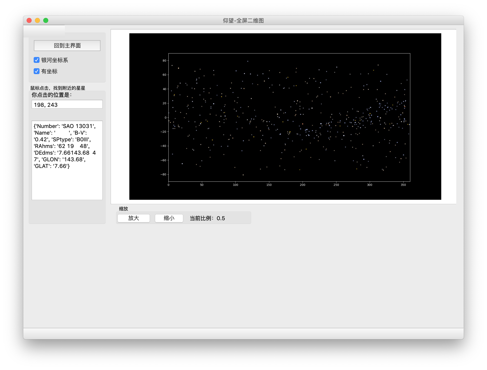

#仰望V1.0

##运行要求：

```requirements.txt```

##用户手册：

```UserInterfaceManual.pdf```

## 项目文档

英文：```LookUp-doc.pdf```

中文：```Docx/仰望-doc.docx```

## 卫星数据可视化

under ```./satellites``` DIR

##运行

```python mainLogic.py```

## 项目截图



